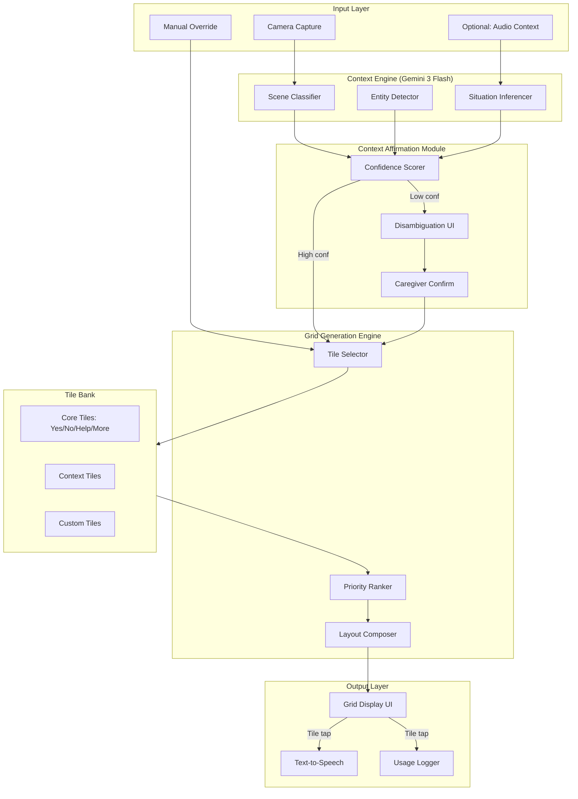
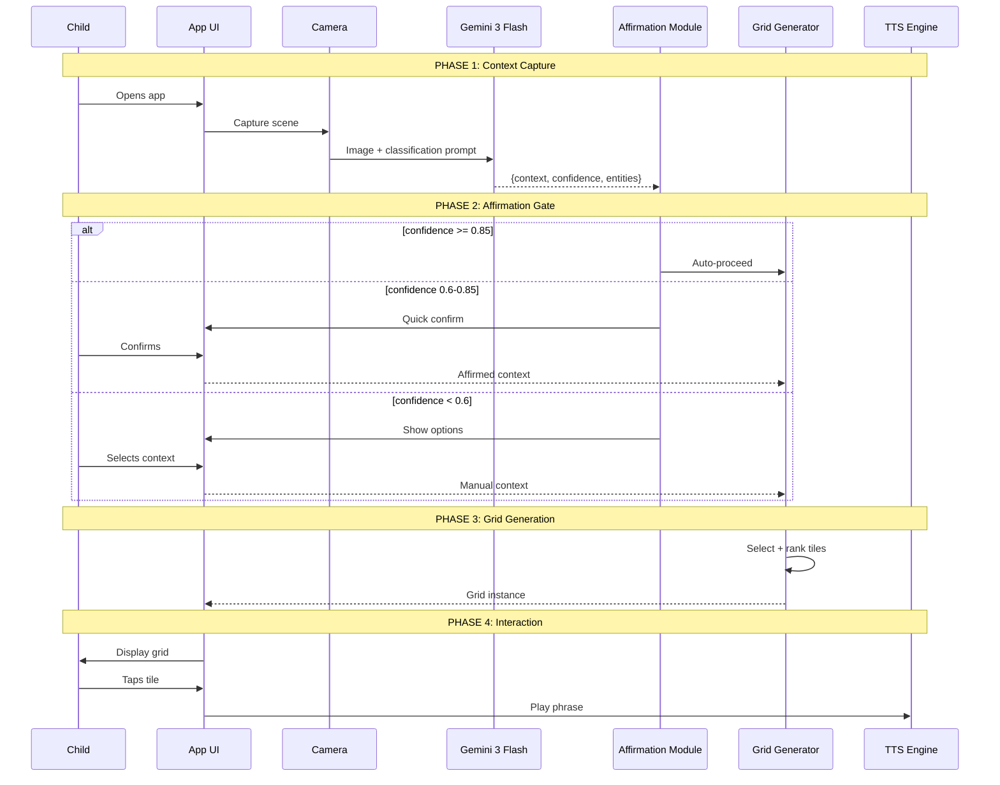
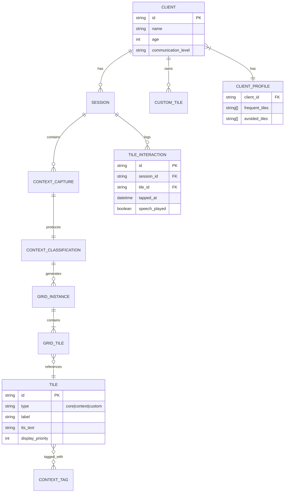

# AAC Domain Specification

Core domain logic for the context-aware AAC communication system.

## Architecture Overview



---

## Module 1: Context Affirmation

### Why This Matters
A child shown wrong tiles loses trust. False positives (wrong context) are worse than asking for confirmation.

### Input Contract
```typescript
interface ContextClassification {
  primaryContext: ContextType;
  secondaryContexts: ContextType[];
  confidenceScore: number;        // 0.0 - 1.0
  entitiesDetected: string[];
  situationInference: string;
}

type ContextType =
  | 'restaurant_counter'
  | 'restaurant_table'
  | 'playground'
  | 'classroom'
  | 'home_kitchen'
  | 'home_living'
  | 'store_checkout'
  | 'medical_office'
  | 'unknown';
```

### Affirmation Thresholds

| Confidence | Action | UI |
|------------|--------|-----|
| **≥ 0.85** | Auto-proceed | None |
| **≥ 0.60** | Quick confirm | "Are you at a [context]?" |
| **≥ 0.30** | Disambiguation | Top 3 options |
| **< 0.30** | Manual | Full context picker |

### Core Flow



### Output Contract
```typescript
interface AffirmationResult {
  affirmed: boolean;
  method: 'auto' | 'quick_confirm' | 'disambiguation' | 'manual';
  finalContext: ContextType | null;
  showUI: boolean;
  uiOptions?: AffirmationUI;
}
```

---

## Module 2: Grid Generation Engine

### Why This Matters
The grid is the child's "voice." Wrong tiles = frustration. Right tiles in wrong order = slow communication.

### Generation Logic

1. **Gather candidates**: Core tiles (always) + Context tiles + Custom tiles
2. **Score each tile**: Base priority + frequency bonus
3. **Filter**: Remove avoided tiles
4. **Select top N**: Based on grid size (6, 9, or 12)
5. **Arrange**: Standard layout (core in corners, context in middle)

### Input Contract
```typescript
interface GridRequest {
  affirmedContext: ContextType;
  gridSize: 6 | 9 | 12;
  entities?: string[];           // For dynamic boosting
  situationInference?: string;
}
```

### Output Contract
```typescript
interface GridTile {
  id: string;
  label: string;
  tts: string;
  emoji: string;
  priority: number;
  position: number;
  row: number;
  col: number;
  relevanceScore: number;
}
```

---

## Tile Bank Schema

### Core Tiles (Always Shown)
```typescript
const CORE_TILES = [
  { id: 'core_yes', label: 'Yes', tts: 'Yes', emoji: '✅', priority: 100 },
  { id: 'core_no', label: 'No', tts: 'No', emoji: '❌', priority: 100 },
  { id: 'core_help', label: 'Help', tts: 'I need help', emoji: '🙋', priority: 100 },
  { id: 'core_more', label: 'More', tts: null, emoji: '➕', priority: 100, action: 'expand_grid' },
];
```

### Context Tile Sets

```typescript
const TILE_SETS: Record<ContextType, TileDefinition[]> = {
  restaurant_counter: [
    { id: 'rc_1', label: 'I want to order', tts: 'I would like to order please', emoji: '🍽️', priority: 10 },
    { id: 'rc_2', label: 'Menu please', tts: 'Can I see the menu please?', emoji: '📋', priority: 9 },
    { id: 'rc_3', label: 'How much?', tts: 'How much does that cost?', emoji: '💰', priority: 8 },
    { id: 'rc_4', label: 'Water please', tts: 'Can I have some water please?', emoji: '💧', priority: 7 },
    { id: 'rc_5', label: 'That one', tts: 'I would like that one please', emoji: '👆', priority: 8 },
    { id: 'rc_6', label: 'Pay now', tts: 'I would like to pay please', emoji: '💳', priority: 7 },
  ],

  playground: [
    { id: 'pg_1', label: 'Can I play?', tts: 'Can I play with you?', emoji: '🎮', priority: 10 },
    { id: 'pg_2', label: 'My turn', tts: 'It is my turn now', emoji: '🙋', priority: 9 },
    { id: 'pg_3', label: 'Push me', tts: 'Can you push me please?', emoji: '🫷', priority: 8 },
    { id: 'pg_4', label: 'Higher!', tts: 'Higher please!', emoji: '⬆️', priority: 7 },
    { id: 'pg_5', label: 'Stop', tts: 'Stop please', emoji: '🛑', priority: 9 },
    { id: 'pg_6', label: 'Again!', tts: 'Again! Let us do it again!', emoji: '🔄', priority: 7 },
  ],

  // Additional contexts: classroom, home_kitchen, home_living, store_checkout, medical_office
};
```

---

## Data Model (Future)



---

## Module 3: Entity Chips (Interactive Object Detection)

### Why This Matters
A child pointing at a swing wants swing-related tiles NOW. Entity detection happens but was invisible to the child. Entity Chips give the child control over what they want to communicate about.

### How It Works

```
Camera frame → Gemini API → entitiesDetected: ["swing", "child", "slide"]
                               ↓
                    EntityChips component renders:
                    ┌────────────────────────────────────┐
                    │ I see: [🎢 Swing] [👧 Child] [🛝 Slide] │
                    └────────────────────────────────────┘
                               ↓ Child taps [🎢 Swing]
                    1. Related tiles highlight (yellow glow)
                    2. Related tiles move to front of bar
                    3. focusedEntity stored for LLM context
```

### Entity-to-Tile Mapping

```typescript
const ENTITY_TILE_MAP: Record<string, string[]> = {
  // Playground
  'swing': ['pg_3', 'pg_4', 'pg_2'],      // Push me, Higher!, My turn
  'slide': ['pg_2', 'pg_7'],               // My turn, Again
  'children': ['pg_1', 'pg_2'],            // Can I play?, My turn

  // Restaurant
  'cashier': ['rc_3', 'rc_7'],             // How much?, Pay now
  'menu': ['rc_2'],                        // Menu please
  'food': ['rc_5', 'rc_1'],                // That one, Order
};
```

### State Contract

```typescript
// In AACState
detectedEntities: string[];      // ["swing", "child", "slide"]
focusedEntity: string | null;    // "swing" when chip tapped

// Actions
| { type: 'SET_ENTITIES'; payload: string[] }
| { type: 'FOCUS_ENTITY'; payload: string | null }
```

### UI Behavior

| Action | Result |
|--------|--------|
| Chip tap | Select entity, highlight related tiles |
| Chip tap again | Deselect, remove highlighting |
| New frame | Update entities, clear focus if entity gone |

---

## Implementation Notes

- **Code location**: `src/lib/tiles.ts`
- **Affirmation logic**: Implemented in `affirmContext()` function
- **Grid generation**: Implemented in `generateGrid()` function
- **Entity mapping**: Defined as `ENTITY_TILE_MAP` constant
- **Tile bank**: Defined as `TILE_SETS` and `CORE_TILES` constants
- **Entity chips**: `src/components/EntityChips.tsx`
- **State management**: `src/hooks/useAACState.ts`
